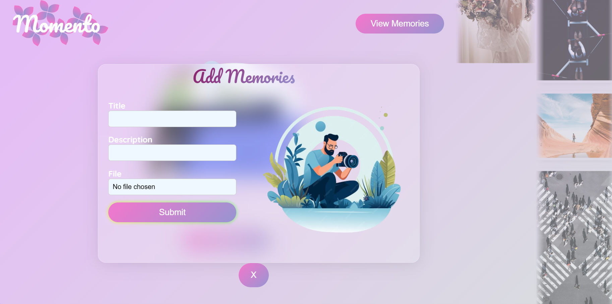
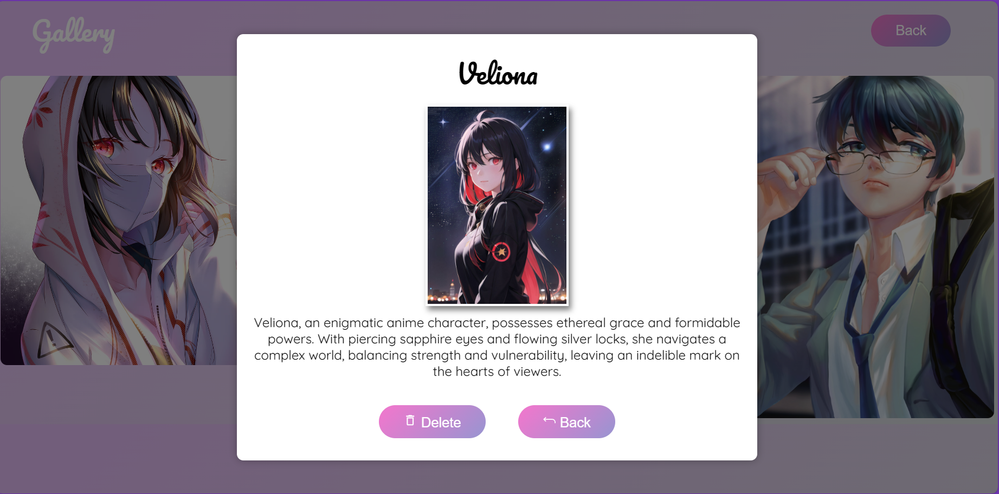

# Momento

Memento is your go-to photo management site, offering a visually appealing platform to effortlessly upload, store, and delete photos. Immerse yourself in a seamless experience powered by React, Framer Motion, and CSS. Backed by Firebase for reliable storage and featuring interactive notifications through Toastify.

## Tech Stack

**Client:** React, Framer Motion, CSS, Toastify, React-icons

**Server:** Firebase

## Features

- Live previews
- Fullscreen mode
- Cross platform

## Screenshots

## Authors

- [@Vicky chawand](https://github.com/VickyChawand)

